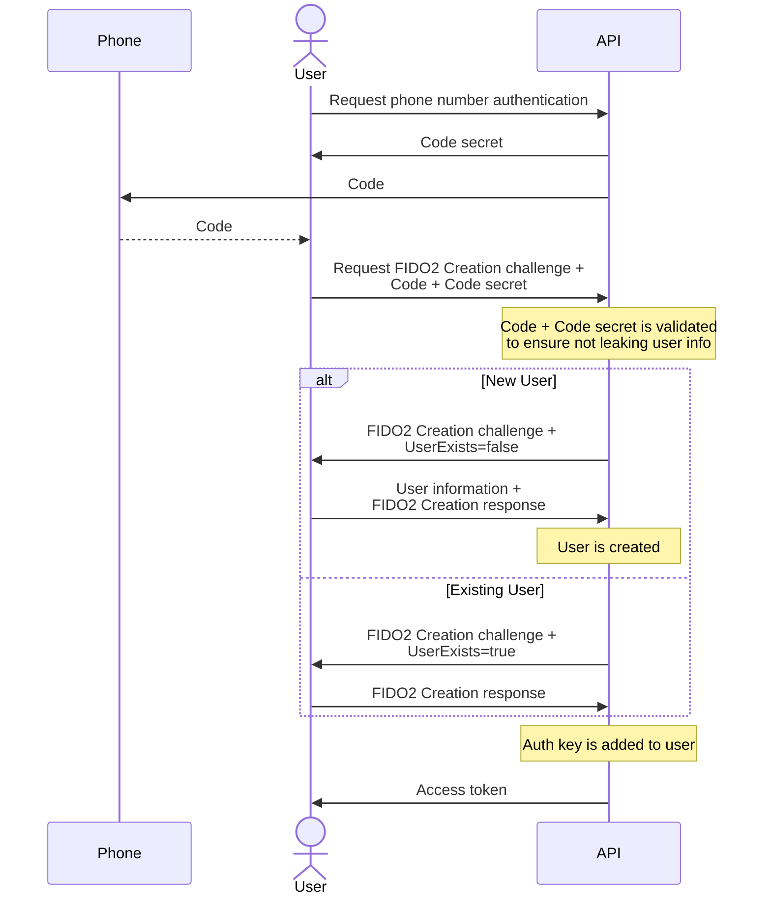
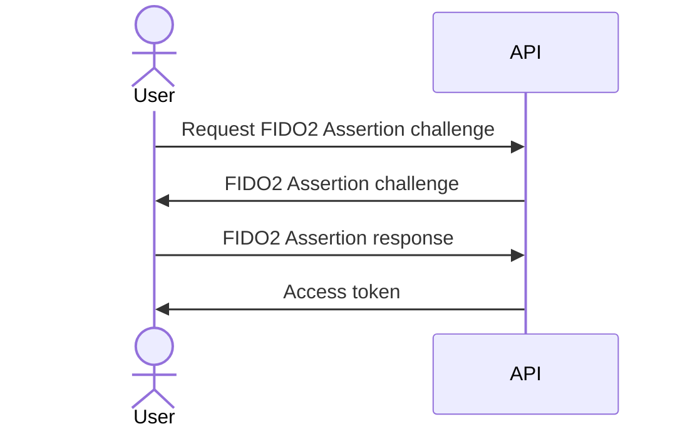

# User authentication

## Creating user key

```mermaid
sequenceDiagram
    participant Phone
    actor User
    participant API

    User ->> API: Request phone number authentication
    API ->> User: Code secret
    API ->> Phone: Code
    Phone -->> User: Code
    User ->> API: Request FIDO2 Creation challenge +<br/>Code + Code secret
    Note over API: Code + Code secret is validated<br/>to ensure not leaking user info
    alt New User
        API ->> User: FIDO2 Creation challenge +<br/>UserExists=false
        User ->> API: User information +<br/>FIDO2 Creation response
        Note over API: User is created
    else Existing User
        API ->> User: FIDO2 Creation challenge +<br/>UserExists=true
        User ->> API: FIDO2 Creation response
    end
    Note over API: Auth key is added to user
    API ->> User: Access token
```

## Signing in

```mermaid
sequenceDiagram
    actor User
    participant API

    User ->> API: Request FIDO2 Assertion challenge
    API ->> User: FIDO2 Assertion challenge
    User ->> API: FIDO2 Assertion response
    API ->> User: Access token
```
